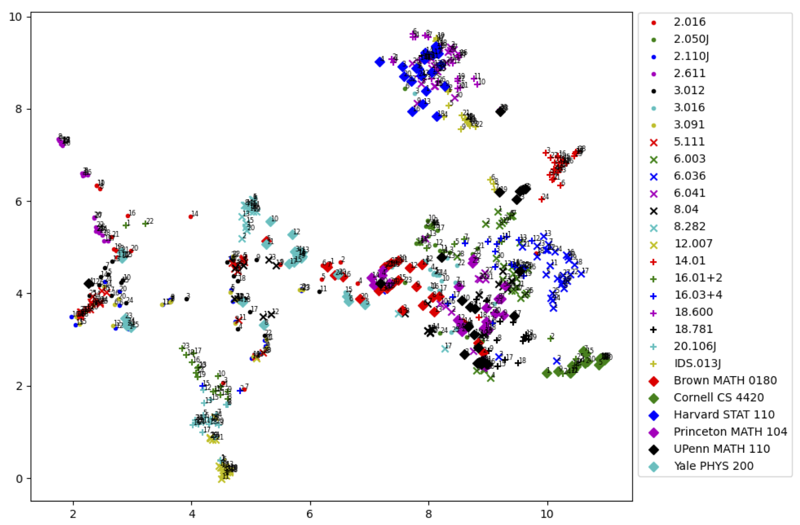

Visualization of embeddings of course questions: We embed the course questions into a 2,048-dimensional space capturing semantic similarity between texts. We then use uniform manifold approximation and projection to reduce the dimensionality to two, observing distinct clusters based on course topics. On the top right, we see a cluster of questions from probability and statistics courses: MIT’s 6.041 Introduction to Probability, 18.600 Probability and Random Variables, MIT’s IDS013J Statistical Thinking and Data Analysis, and Harvard’s STAT 110. On the left side, we see a cluster of the questions from Mechanical Engineering courses: MIT’s 2.611, 2.016, and 2.110J. Next, we see a cluster of questions from Chemistry and Materials Science and Engineering on the left. On the bottom left, we see a cluster of the questions from Aeronautics and Astronautics: 16.01, 16.02, 16.03, and 16.04. Below is a cluster of questions from MIT’s 20.106J System Microbiology and 12.007 Geobiology. In the center, we see a cluster of questions from YALE PHYS 200, MIT’s Quantum Physics, and Introduction to Astronomy, all related to Physics. On the right, we see a cluster of questions from MIT EECS courses. A cluster of questions from math courses appears in the center between EECS and Physics.

